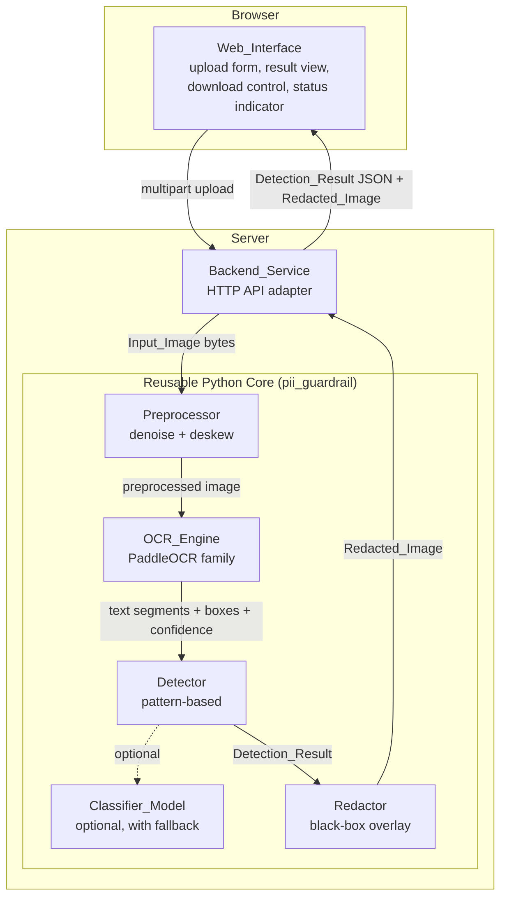
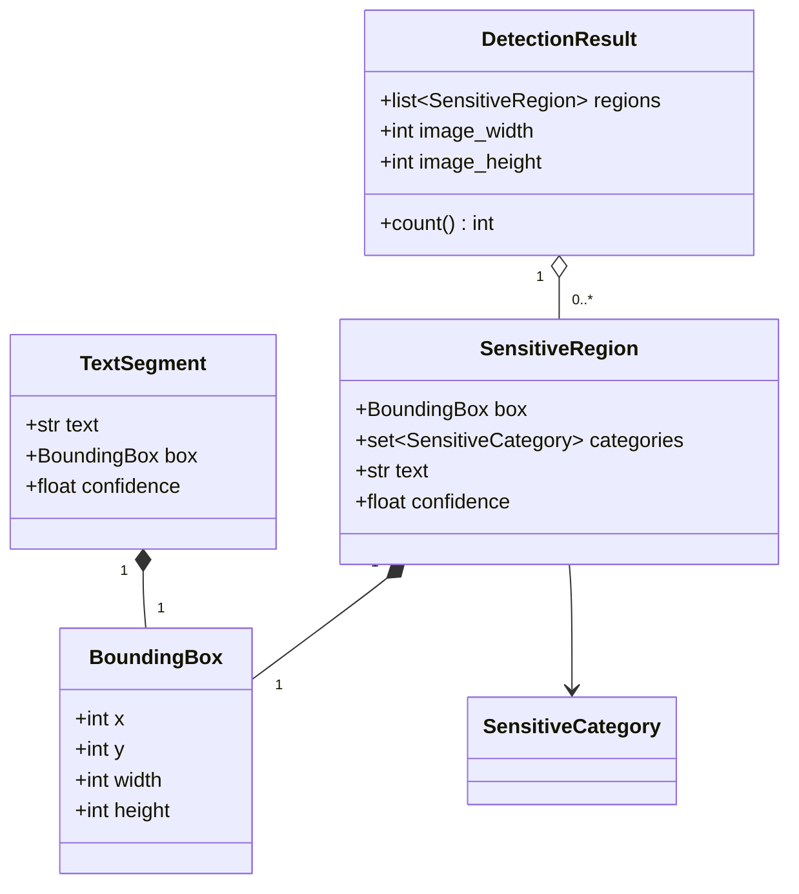
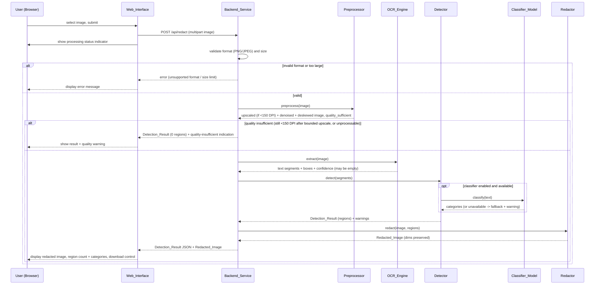

# Design Document

## Overview

The Thai Image PII Guardrail is a web application that finds sensitive data in images and redacts it with filled black rectangles. It has three layers:

1. **Web_Interface** — a browser frontend for uploading an image and viewing/downloading the `Detection_Result` and `Redacted_Image`.
2. **Backend_Service** — a Python HTTP API that receives uploads, orchestrates the processing pipeline, and returns results.
3. **Reusable Python core** — a framework-agnostic package (`pii_guardrail`) containing the `Preprocessor`, `OCR_Engine`, `Detector` (with optional `Classifier_Model`), and `Redactor`. The Backend_Service is a thin adapter over this core.

The design is deliberately split so the core carries all detection/redaction logic and has no dependency on the web framework, HTTP types, or the browser. This lets a separate personal project consume the same core directly as a library. (Requirement: reusable Python core invoked by the Backend_Service.)

Design priorities, in order:

1. **Detection accuracy on scanned documents** is the primary pain point. The pipeline is built around a preprocessing stage (noise reduction + skew correction to within 1 degree) that runs before OCR, because OCR quality on noisy/skewed scans is the dominant factor in whether sensitive data gets located at all. (Requirement 6)
2. **Thai-first recognition**, with Latin-script support alongside it. (Requirement 2.3, 2.4)
3. **Redaction** as a required but secondary capability: a simple, correct black-box overlay covering the full bounding box. (Requirement 8)

### Key Design Decisions

| Decision | Rationale | Requirements |
|---|---|---|
| Split into Web_Interface + Backend_Service + reusable core | Core must be reusable outside the web layer; keeps OCR/detection testable in isolation | Reusable core |
| Server-side OCR with PaddleOCR family | PaddleOCR ships strong Thai + Latin recognition models, angle classification, and a detection+recognition pipeline suited to noisy scans; running server-side avoids shipping heavy models to the browser | 2.3, 2.4, 2.5, 6 |
| Pattern-based detection by default, optional `Classifier_Model` with fallback | Deterministic, fast, no model dependency by default; model can improve ambiguous Thai names/orgs but must never be a hard dependency | 3, 4, 5 |
| Preprocess before OCR for scans | Denoise + deskew materially improves OCR recall on scanned documents, the core priority | 6.2, 6.3, 6.4, 6.5 |
| Detection-first data model (`Detection_Result` produced before redaction) | Lets the user verify located regions independently and drives redaction from the same structure | 7, 8 |
| No persistence | Image storage/retention is out of scope; only transient in-memory/temp processing per request | Introduction |

## Architecture

### High-Level Architecture



### Layering and Boundaries

- The **core** exposes a single high-level entry point (`GuardrailPipeline.process`) plus each component as an independently usable class. It works on in-memory image arrays and returns plain Python data objects. It has no knowledge of HTTP.
- The **Backend_Service** owns everything web-specific: multipart parsing, format/size validation at the transport edge, converting core objects to JSON, encoding the `Redacted_Image` for transport, and mapping core errors to HTTP responses.
- The **Web_Interface** owns presentation only: the upload control, the processing status indicator, rendering the redacted image and the region summary, and the download control.

This boundary is what makes the core reusable: the personal reuse project imports `pii_guardrail` and calls `GuardrailPipeline.process` without pulling in any web dependency.

### Technology Choices

**OCR — PaddleOCR family (server-side).** PaddleOCR provides pretrained Thai and Latin recognition models, a text-detection model that yields per-region quadrilaterals, and an angle classifier. Its detect-then-recognize design fits noisy scanned documents better than a single-pass recognizer, and its bounding-box output maps directly onto our `Bounding_Box` and redaction needs. It runs server-side because the models are large and GPU/CPU heavy. (Requirement 2.5, 6)

**Backend web framework — FastAPI (recommended).** FastAPI gives typed request/response models, built-in multipart upload handling, straightforward file-size limiting, automatic OpenAPI docs, and async I/O for uploads while CPU-bound OCR runs in a worker thread/pool. Its Pydantic models make the `Detection_Result` contract explicit and self-documenting. Flask is a viable simpler alternative; FastAPI is preferred for the typed contract and validation ergonomics.

**Frontend approach — a single-page static frontend (recommended: minimal React or plain HTML/JS).** The UI needs are modest: one upload form, a status indicator, an image preview, a category summary list, and a download button. A lightweight SPA (or even a single static page with fetch) served as static assets keeps the surface small and avoids coupling the frontend build to the backend. The frontend talks to the Backend_Service over JSON + a binary image response (or base64-embedded image).

**Core imaging libraries.** OpenCV + NumPy for preprocessing (denoise, deskew) and for drawing redaction rectangles; Pillow for format loading/saving (PNG/JPEG). PaddleOCR consumes NumPy arrays directly.

**Optional Classifier_Model.** A small language/classifier model (e.g., a compact transformer or a lightweight Thai NER model) loaded lazily. It is strictly optional and behind a feature flag; the Detector always retains the pattern-based path as the source of truth when the model is disabled or unavailable. (Requirement 5)

## Components and Interfaces

All core interfaces below are framework-agnostic Python. Types use dataclasses (see Data Models).

### Preprocessor

Responsibility: prepare an image for OCR, with special handling for scanned documents (noise reduction and skew correction). (Requirement 6.2, 6.3, 6.6)

```python
class Preprocessor:
    def preprocess(self, image: NDArray, is_scanned: bool | None = None) -> PreprocessResult:
        """Return a cleaned, deskewed image plus metadata.

        - Reduces noise (e.g., denoising filter) before OCR.
        - Detects skew angle and rotates so text rows align to within 1 degree
          of horizontal.
        - Estimates effective resolution. When below the 150 DPI reliability
          threshold, auto-upscales the image toward the threshold (Option A,
          bounded by a max factor) BEFORE denoise/deskew, so a low-resolution
          input can still be OCR'd. Only when the bounded upscale cannot reach
          the threshold is the image flagged as insufficient quality.
        Raises InvalidImageError if the array is empty/corrupt.
        """

    def estimate_skew_angle(self, image: NDArray) -> float:
        """Return the detected skew angle in degrees."""
```

```python
@dataclass
class PreprocessResult:
    image: NDArray            # denoised + deskewed
    residual_skew_deg: float  # absolute residual angle after correction (<= 1.0 on success)
    estimated_dpi: float | None  # effective DPI AFTER any auto-upscale
    quality_sufficient: bool  # False only when still below 150 DPI after the bounded upscale
    upscaled: bool = False  # True when the image was enlarged to reach the threshold
    upscale_factor: float = 1.0  # linear scale applied when upscaled (1.0 otherwise)
```

Notes:
- `is_scanned` may be inferred (default) or supplied by the caller. When unknown, the Preprocessor runs the scan-oriented path conservatively; a clean synthetic image passing through denoise/deskew is a near no-op because its residual skew is already ~0.
- The 1-degree target is a post-condition of skew correction. (Requirement 6.3)
- **Auto-upscale (Option A), Requirement 6.6:** an input estimated below the 150 DPI threshold is enlarged with cubic interpolation toward a target DPI (default 150), bounded by a maximum upscale factor (default 4x), BEFORE denoise/deskew. Denoising is applied more gently on an upscaled image so it does not erase the already-thin interpolated glyph strokes. **Trade-off (documented limitation):** because detection and redaction run on the enlarged image, the returned `Redacted_Image` is LARGER than the uploaded image; upscaling improves OCR legibility but does not recover detail the source never had, so detection accuracy on genuinely low-resolution inputs may be reduced. When even the maximum-factor upscale cannot reach the threshold, the image is still flagged `quality_sufficient == False` (fail-closed).

### OCR_Engine

Responsibility: extract text segments and their bounding boxes with confidence, using a PaddleOCR-family model when available. (Requirement 2)

```python
class OCREngine:
    def __init__(self, backend: OCRBackend | None = None): ...

    def extract(self, image: NDArray) -> list[TextSegment]:
        """Extract recognized text segments.

        - Recognizes Thai and Latin script.
        - Each segment has text, a Bounding_Box in pixel coords (top-left origin),
          and a confidence in [0.0, 1.0].
        - Returns [] when no text is found (not an error).
        Raises InvalidImageError for missing/corrupt/unsupported input.
        Raises OCRProcessingError if extraction fails after accepting valid input.
        """
```

```python
class OCRBackend(Protocol):
    """Abstraction so PaddleOCR can be swapped/mocked; enables PBT via a fake backend."""
    def run(self, image: NDArray) -> list[TextSegment]: ...

    @property
    def available(self) -> bool: ...
```

Notes:
- The default backend is `PaddleOCRBackend`. Because PaddleOCR availability is a runtime concern (Requirement 2.5 uses WHERE ... available), the engine takes an injectable backend. On failure after accepting valid input, it raises rather than returning a partial result. (Requirement 2.9)
- Coordinates are normalized to an axis-aligned `Bounding_Box` even though PaddleOCR returns quadrilaterals; the axis-aligned box is the enclosing rectangle. (Requirement 2.2)

### Detector

Responsibility: classify each `TextSegment` into zero or more `Sensitive_Category` values and build `Sensitive_Region`s. Pattern-based by default; optionally consults the `Classifier_Model`. (Requirements 3, 4, 5)

```python
class Detector:
    def __init__(self, classifier: ClassifierModel | None = None,
                 use_classifier: bool = False): ...

    def classify_segment(self, text: str) -> set[SensitiveCategory]:
        """Return every matching category (possibly empty) for one text segment.

        - Empty/whitespace-only text -> empty set (non-sensitive).
        - A segment may match multiple categories.
        - Uses pattern matching by default; if use_classifier and the model is
          available, merges model results with patterns; if enabled-but-unavailable,
          falls back to patterns and records a warning.
        """

    def detect(self, segments: list[TextSegment]) -> DetectionOutcome:
        """Build Sensitive_Regions for all sensitive segments, preserving boxes."""
```

```python
@dataclass
class DetectionOutcome:
    regions: list[SensitiveRegion]
    warnings: list[str]   # e.g., classifier-unavailable fallback notice
```

Pattern-based classification covers: person name, organization name (incl. Thai-script names/orgs), phone number, URL, email address, money amount, percent value, API key, access token, and generic secret patterns. Thai name/org detection uses Thai-specific heuristics/gazetteer and, when enabled, the `Classifier_Model`. (Requirements 3.1–3.11, 4.1–4.3)

### Classifier_Model (optional)

Responsibility: assist classification of ambiguous text (especially Thai names/orgs). Strictly optional. (Requirement 5)

```python
class ClassifierModel(Protocol):
    @property
    def available(self) -> bool: ...

    def classify(self, text: str) -> set[SensitiveCategory]:
        """Return categories the model believes apply. Raises ClassifierUnavailableError
        if invoked while unavailable, which the Detector catches to fall back."""
```

The Detector treats the model as advisory: results are unioned with pattern results. If `use_classifier` is true but `available` is false (or a call fails), the Detector uses pattern results only and appends a warning to `DetectionOutcome.warnings`. (Requirement 5.3)

### Redactor

Responsibility: draw filled black rectangles over every `Sensitive_Region`, preserving image dimensions. (Requirement 8)

```python
class Redactor:
    def redact(self, image: NDArray, regions: list[SensitiveRegion]) -> NDArray:
        """Return a copy of image with a solid black rectangle covering the full
        Bounding_Box of each region. With zero regions, returns an image equivalent
        to the input. Output dimensions equal input dimensions."""
```

### GuardrailPipeline (core entry point)

Responsibility: orchestrate the full flow for a single image; this is the primary reuse surface. (Ties Requirements 2, 3, 4, 6, 7, 8 together)

```python
class GuardrailPipeline:
    def __init__(self, preprocessor, ocr_engine, detector, redactor): ...

    def process(self, image: NDArray, *, redact: bool = True) -> PipelineResult:
        """preprocess -> OCR -> detect -> (optional) redact.
        Returns Detection_Result and, if redact, the Redacted_Image.
        Propagates InvalidImageError / OCRProcessingError."""
```

```python
@dataclass
class PipelineResult:
    detection_result: DetectionResult
    redacted_image: NDArray | None
    quality_sufficient: bool
    warnings: list[str]
```

### Backend_Service interface (web adapter)

Responsibility: HTTP surface over the core. Owns format/size validation, JSON serialization, image encoding, and error mapping. (Requirements 1, 7, 9) Detailed contract in the Web API Contract section below.

## Data Models

All core models are plain dataclasses with no web dependency.

```python
class SensitiveCategory(str, Enum):
    PERSON_NAME = "person_name"
    ORGANIZATION_NAME = "organization_name"
    PHONE_NUMBER = "phone_number"
    URL = "url"
    EMAIL = "email"
    MONEY_AMOUNT = "money_amount"
    PERCENT_VALUE = "percent_value"
    API_KEY = "api_key"
    ACCESS_TOKEN = "access_token"
    SECRET = "secret"
```

```python
@dataclass(frozen=True)
class BoundingBox:
    x: int       # left, pixels from top-left origin
    y: int       # top, pixels from top-left origin
    width: int   # > 0
    height: int  # > 0
    # Invariant: x >= 0, y >= 0, width > 0, height > 0,
    # and x + width <= image_width, y + height <= image_height.
```

```python
@dataclass
class TextSegment:
    text: str
    box: BoundingBox
    confidence: float   # 0.0 <= confidence <= 1.0
```

```python
@dataclass
class SensitiveRegion:
    box: BoundingBox
    categories: set[SensitiveCategory]  # non-empty for a sensitive region
    text: str                           # source text (for verification/debug)
    confidence: float                   # OCR confidence of the source segment
```

```python
@dataclass
class DetectionResult:
    regions: list[SensitiveRegion]
    image_width: int
    image_height: int

    @property
    def count(self) -> int:
        return len(self.regions)
```

Serialization: the Backend_Service maps `DetectionResult` to JSON (see contract). `BoundingBox` serializes as `{x, y, width, height}`; `categories` serialize as a list of category strings.

### Data Model Relationships



## Processing Pipeline



Pipeline stages:

1. **Upload & validate** (Backend_Service): confirm PNG/JPEG and within size limit; load bytes into an image array. (Requirement 1)
2. **Preprocess** (Preprocessor): auto-upscale below-threshold inputs toward 150 DPI (bounded, Option A), then denoise, deskew to within 1 degree, and estimate quality. (Requirement 6.2, 6.3, 6.6)
3. **OCR** (OCR_Engine): extract text segments, boxes, confidence; empty result is valid. (Requirement 2)
4. **Classify/Detect** (Detector, optional Classifier_Model): map segments to categories, build regions. (Requirements 3, 4, 5)
5. **Redact** (Redactor): black-box every region; no regions -> equivalent image. (Requirement 8)
6. **Return** (Backend_Service -> Web_Interface): structured Detection_Result + Redacted_Image; UI displays and offers download. (Requirements 7, 9)

## Web API Contract

Base path `/api`. Content negotiation returns JSON with the redacted image base64-embedded (simplest single-response contract); a binary variant is noted below.

### POST /api/redact

Request: `multipart/form-data`
- `image` (file, required): PNG or JPEG.
- `redact` (bool, optional, default true).

Success `200 application/json`:
```json
{
  "detection_result": {
    "image_width": 1240,
    "image_height": 1754,
    "count": 2,
    "regions": [
      {
        "box": { "x": 120, "y": 300, "width": 240, "height": 40 },
        "categories": ["person_name"],
        "confidence": 0.94
      },
      {
        "box": { "x": 130, "y": 420, "width": 300, "height": 38 },
        "categories": ["email"],
        "confidence": 0.88
      }
    ]
  },
  "redacted_image": { "format": "png", "base64": "iVBORw0KGgo..." },
  "quality_sufficient": true,
  "warnings": []
}
```

Notes:
- When `count` is 0, `regions` is `[]` and `redacted_image` equals the (re-encoded) input. (Requirement 8.4, 2.6)
- When image quality is insufficient (still below threshold after the bounded auto-upscale), returns `200` with `quality_sufficient: false`, `count: 0`, and a warning string; no reliable regions are asserted. (Requirement 6.6)
- When a below-threshold image is auto-upscaled to reach the threshold (Option A), returns `200` with `quality_sufficient: true` and a warning noting the upscale. The returned `redacted_image` (and the `detection_result` dimensions) correspond to the UPSCALED image, so they are LARGER than the uploaded image. (Requirement 6.6)
- `warnings` may contain the classifier-fallback notice. (Requirement 5.3)

Errors (`application/json`, non-2xx):
```json
{ "error": { "code": "UNSUPPORTED_FORMAT", "message": "Only PNG and JPEG are supported.", "detail": "received: image/gif" } }
```

| HTTP | code | Trigger | Requirement |
|---|---|---|---|
| 415 | `UNSUPPORTED_FORMAT` | Not PNG/JPEG | 1.3, 1.4 |
| 413 | `FILE_TOO_LARGE` | Exceeds max upload size (identifies limit) | 1.5 |
| 400 | `INVALID_IMAGE` | Missing/corrupt image bytes | 2.8 |
| 422 | `OCR_FAILED` | OCR failed after accepting valid input; no partial result | 2.9 |
| 500 | `INTERNAL_ERROR` | Unexpected failure | 9.6 |

- Max upload size is a configured constant (default recommendation: 10 MB) surfaced in the 413 message. (Requirement 1.5)
- A binary-response alternative: `redacted_image` returned as `image/png` body with `Detection_Result` in an `X-Detection-Result` header or a separate `GET`; base64-embedding is chosen as the default for a single atomic response.

### GET /api/health
Returns `{ "status": "ok", "ocr_backend_available": true }` for readiness and to surface PaddleOCR availability.

## Error Handling

Errors are modeled as a small exception hierarchy in the core and mapped to HTTP by the Backend_Service.

```python
class GuardrailError(Exception): ...
class InvalidImageError(GuardrailError): ...       # missing/corrupt/unsupported (2.8)
class UnsupportedFormatError(InvalidImageError): ...# non-PNG/JPEG (1.3)
class FileTooLargeError(GuardrailError): ...        # exceeds size limit (1.5)
class OCRProcessingError(GuardrailError): ...       # failure after valid input (2.9)
class ClassifierUnavailableError(GuardrailError): ...# caught internally -> fallback (5.3)
```

Handling strategy:

- **Validation at the edge:** format and size are checked in the Backend_Service before the core runs, so oversized/unsupported uploads never reach OCR. (Requirements 1.3, 1.4, 1.5)
- **Fail-closed OCR:** if OCR fails after accepting valid input, the pipeline halts and returns no partial `Detection_Result`; the API returns `OCR_FAILED`. (Requirement 2.9)
- **Empty vs. error are distinct:** zero text segments is a normal success producing zero regions, not an error. (Requirement 2.6)
- **Quality insufficiency is not an exception:** below-threshold scans return a normal `Detection_Result` with zero reliable regions plus a quality-insufficient indication, not an error. (Requirement 6.6)
- **Classifier fallback is silent to the user flow but recorded:** a `ClassifierUnavailableError` is caught by the Detector, which falls back to patterns and appends a warning; processing continues. (Requirement 5.3)
- **Frontend surfacing:** any error response is rendered as a human-readable message; warnings are shown alongside successful results. (Requirement 9.6)
- **No persistence on failure:** because storage is out of scope, temp buffers are released regardless of success or failure.

## Correctness Properties

*A property is a characteristic or behavior that should hold true across all valid executions of a system-essentially, a formal statement about what the system should do. Properties serve as the bridge between human-readable specifications and machine-verifiable correctness guarantees.*

These properties target the reusable Python core's pure logic (validation, classification, bounding-box geometry, redaction geometry, serialization, and the classifier-fallback rule). PaddleOCR recognition quality, Thai/Latin recognition accuracy, and the scanned-document recall benchmark are validated by integration tests over sample corpora (see Testing Strategy), not by property tests, because they exercise external model behavior rather than our code.

### Property 1: Unsupported formats are rejected with the format identified

*For any* uploaded file whose format is not PNG or JPEG, the Backend_Service upload validation SHALL reject the upload and the returned error SHALL identify the received format.

**Validates: Requirements 1.3, 1.4**

### Property 2: Oversized uploads are rejected with the limit identified

*For any* upload whose byte length exceeds the configured maximum, the Backend_Service SHALL reject it and the returned error SHALL contain the size limit; *for any* upload within the limit, the size check SHALL pass.

**Validates: Requirements 1.5**

### Property 3: Bounding-box normalization stays within the image and encloses its source

*For any* OCR text-region quadrilateral whose vertices lie inside an image of width W and height H, the normalized axis-aligned `BoundingBox` SHALL satisfy x >= 0, y >= 0, width > 0, height > 0, x + width <= W, y + height <= H, and SHALL contain every vertex of the source quadrilateral.

**Validates: Requirements 2.2**

### Property 4: No recognized text yields zero sensitive regions

*For any* Input_Image for which the OCR_Engine returns no text segments, the resulting `DetectionResult` SHALL contain zero `SensitiveRegion`s (count == 0).

**Validates: Requirements 2.6**

### Property 5: Confidence values are within range

*For any* `TextSegment` produced by the OCR_Engine and *any* `SensitiveRegion` derived from it, the confidence value SHALL satisfy 0.0 <= confidence <= 1.0.

**Validates: Requirements 2.7**

### Property 6: Invalid input fails closed with no partial result

*For any* input that is missing, corrupt, or of an unsupported format, and *for any* OCR failure occurring after a valid image is accepted, the OCR_Engine/pipeline SHALL raise an error and produce no `DetectionResult` (no partial regions).

**Validates: Requirements 2.8, 2.9**

### Property 7: Classification is total and returns a set of categories

*For any* text string, `classify_segment` SHALL return a set of `SensitiveCategory` values (the empty set denoting non-sensitive) without raising.

**Validates: Requirements 3.1**

### Property 8: Category-bearing text is classified into its category

*For any* generated string of a given sensitive category — person name, organization name (including Thai-script names and organizations), phone number, URL, email address, money amount, percent value, API key, access token, or other known secret pattern — `classify_segment` SHALL return a set that includes that category.

**Validates: Requirements 3.2, 3.3, 3.4, 3.5, 3.6, 3.7, 3.8, 3.9, 4.1, 4.2, 4.3**

### Property 9: Multi-category text yields all matching categories

*For any* text string constructed by combining tokens from N distinct sensitive categories, `classify_segment` SHALL return a set containing all N categories.

**Validates: Requirements 3.10**

### Property 10: Whitespace-only text is non-sensitive

*For any* string composed entirely of whitespace characters (including the empty string), `classify_segment` SHALL return the empty set and the Detector SHALL create no `SensitiveRegion` for the corresponding Text_Region.

**Validates: Requirements 3.11**

### Property 11: Disabled classifier equals pattern-only classification

*For any* text string, when the `Classifier_Model` is disabled, the Detector's classification result SHALL equal the result of pattern-based classification alone.

**Validates: Requirements 5.2**

### Property 12: Enabled-but-unavailable classifier falls back and warns

*For any* text string, when the `Classifier_Model` is enabled but unavailable at runtime, the Detector SHALL return exactly the pattern-based categories and the `DetectionOutcome.warnings` SHALL be non-empty.

**Validates: Requirements 5.3**

### Property 13: Skew correction aligns text rows within 1 degree

*For any* synthetic image with horizontal text rows rotated by an angle theta within the supported correction range, after preprocessing the residual skew angle SHALL satisfy |residual| <= 1.0 degree.

**Validates: Requirements 6.3**

### Property 14: Insufficient quality yields no reliable regions and a quality indication

*For any* Input_Image that remains below the 150 DPI reliability threshold even after the bounded auto-upscale (Option A) — or that cannot be processed — the `PipelineResult` SHALL have `quality_sufficient == false`, contain zero `SensitiveRegion`s, and include a warning indicating insufficient image quality. (A below-threshold image that the bounded upscale CAN lift to the threshold is instead processed normally, with `quality_sufficient == true`, an upscale warning, and an enlarged output image.)

**Validates: Requirements 6.6**

### Property 15: Every region in a Detection_Result is well-formed and complete

*For any* `DetectionResult`, its `regions` SHALL equal exactly the regions produced by detection (with `count` matching the list length), and every `SensitiveRegion` SHALL have a `BoundingBox` satisfying the box invariants and a non-empty set of `SensitiveCategory` values.

**Validates: Requirements 7.1, 7.2, 7.3**

### Property 16: Detection_Result serialization round-trips

*For any* `DetectionResult`, serializing it to the machine-readable structured format and deserializing it back SHALL produce an equivalent `DetectionResult` (same regions, boxes, categories, and dimensions).

**Validates: Requirements 7.4**

### Property 17: Redaction covers each region's full bounding box in black

*For any* Input_Image and *any* non-empty list of `SensitiveRegion`s, after redaction every pixel within each region's `BoundingBox` (all four corners inclusive) SHALL be black.

**Validates: Requirements 8.1, 8.2**

### Property 18: Redaction with zero regions is an identity

*For any* Input_Image, redacting with an empty region list SHALL produce a `Redacted_Image` pixelwise-equivalent to the Input_Image.

**Validates: Requirements 8.4**

### Property 19: Redaction preserves image dimensions

*For any* Input_Image and *any* list of `SensitiveRegion`s, the `Redacted_Image` SHALL have the same width, height, and channel count as the Input_Image.

**Validates: Requirements 8.5**

## Testing Strategy

A dual approach: property-based tests for the core's universal logic, and example/integration tests for concrete scenarios, wiring, UI, and model-dependent behavior.

### Property-Based Testing

- **Library:** Hypothesis (Python). Do not hand-roll a property runner.
- **Iterations:** each property test runs a minimum of 100 generated cases.
- **Tagging:** each property test carries a comment in the form
  `# Feature: thai-image-pii-guardrail, Property {number}: {property_text}`.
- **One test per property:** each of Properties 1–19 is implemented by a single property-based test.
- **Generators / custom strategies:**
  - Thai and Latin text, including Thai-script person names and organization names (gazetteer-seeded), for classification properties (7–11).
  - Category-shaped strategies for phone numbers, URLs, emails, money amounts, percent values, API keys, and access tokens; and composite strategies that concatenate tokens from multiple categories (Property 9).
  - Whitespace-only strategy including empty string, tabs, newlines, and Unicode whitespace (Property 10).
  - Image strategies producing NumPy arrays of varied dimensions/channels, plus region strategies producing in-bounds `BoundingBox`es (Properties 3, 17, 18, 19).
  - Rotation strategy applying known skew angles to synthetic text-row images (Property 13).
  - A `FakeOCRBackend` returning controlled segment lists (including empty) and a `RaisingOCRBackend` for the fail-closed property (Properties 4, 6).
  - A `FakeClassifierModel` with toggleable `available` for the fallback properties (Properties 11, 12).
- **Serialization:** Property 16 is the mandatory round-trip test for the `DetectionResult` serializer.

### Unit / Example Tests

Focused examples and edge cases that are not universal:
- Loading valid PNG/JPEG bytes into an image array (1.2); accepting PNG and JPEG specifically (1.4).
- Detector consulting an enabled+available classifier via a spy (5.1).
- Denoise-before-OCR ordering via a spy, plus an optional metamorphic noise-metric check (6.2).
- Redactor returns an encodable image (8.3).
- API response contains both `detection_result` and `redacted_image` (9.1).

### Integration Tests (model- and infrastructure-dependent — not PBT)

- PaddleOCR extracts text with boxes on representative Thai and Latin sample images (2.1, 2.3, 2.4, 6.1).
- Default backend is a PaddleOCR backend when available (2.5), and `/api/health` reports availability.
- Detection on a labeled >=150 DPI scanned corpus identifies present regions (6.4).
- **Scanned-vs-synthetic recall benchmark:** over a paired corpus, detection on >=150 DPI scans identifies at least 95% of the regions found in the synthetic counterparts (6.5). This is a statistical evaluation over a dataset, reported as a recall ratio, not a per-input property.

### Frontend Tests (example-based)

- Renders the redacted image (9.2), the region count and category summary (9.3), a working download control (9.4), a processing status indicator during an in-flight request (9.5), and an error message for error responses (9.6).

### Why PBT is scoped to the core

Property-based testing is applied only where a meaningful "for all inputs" statement exists over our own deterministic logic. OCR recognition accuracy, Thai/Latin quality, and the 95% scanned-document recall target depend on the PaddleOCR model and a labeled dataset; running them under randomized generation would test the model, not our code, so they are covered by integration tests and a benchmark instead.
